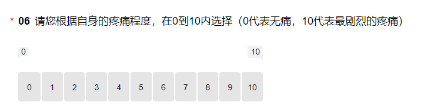

# 问卷算分规则
[TOC]
---
## [膝关节—关节镜（军总）](https://wj.qq.com/s2/10362871/7142)
1. **问卷构造**
6：VAS
7-17：IKDC
18-25：Lysholm
2. **问卷算分**
目标是得到3项分数：VAS得分、IKDC得分、Lysholm得分
   1. VAS 
   
   **$VAS得分 = 第6题患者选择的0-10的数字$**
    
   
   2. IKDC
   + 第7、10、11、13、14题**由上至下依次分值为4、3、2、1、0**
   例如：
   
   + 第8题、第9题的分数计算：**得分 = 10 - 用户所选数字**
   
   + 第12题的分数：**有=0，没有=1**
   
   + 第15题每一小题的分数：**从左至右依次分值为4、3、2、1、0**
   **第15题的分数是所有小项分数之和**
   
   + **注意！第16题没有分数**
   + 第17题的分数：**得分 = 患者选择的0-10的数字**
   
   + **总分**
   **$IKDC得分 = （7到17（除16题外）分数之和 / 87）\times 100$**
    
   
   3. Lysholm
   + 所有题目的分值见图片
   
   
   + **总分**
   **$Lysholm得分 = 18到25题分数之和$**
---
## [肩关节—肩袖关节镜（军总）](https://wj.qq.com/s2/10363795/84f6)
1. **问卷构造**
6：VAS
7-14：WORC（不完整故不算分）
15-22：ASES
2. **问卷算分**
目标是得到2项分数：VAS得分、ASES得分
   1. VAS
   
   **$VAS得分 = 第6题患者选择的0-10的数字$**
    
   
   2. ASES（计入算分的只有21和22题）
   + 第21题的分数：**$得分 = (10 - 患者选择的的数字) \times 5$**
   
   + 第22题的分数：第22题每一个小项的分数**从左至右都是0、1、2、3**
   **第22题的得分为：每一个小项分数之和**
   
   + **总分**
   **$ASES得分 = 21题分数+{5\over3} \times 22题分数$**
---
## [术后—膝关节—关节置换](https://wj.qq.com/s2/10364222/ae62)
1. **问卷构造**
10：VAS
11-19：KOOS
20-31：SF-12
2. **问卷算分**
目标是得到4项分数：VAS得分、KOOS得分、SF-12 PCS得分、SF-12 MCS得分
   1. VAS
   
   **$VAS得分 = 第10题患者选择的0-10的数字$**
    
   
   2. KOOS
   KOOS量表分为5个部分：症状及僵硬得分、疼痛得分、日常生活活动能力得分、运动及娱乐能力得分、生活质量得分；最终的KOOS的得分为5部分分数的平均数
    + 每一题的分数换算：
    11-15题每一题中的小项分数均是**从左至右是0、1、2、3、4**
    16-19题每一题分数均是**从上至下是0、1、2、3、4**
    例如：
    
    
    + **计算各项得分**
    症状及僵硬得分：**$(28-第11题每一个小项分数之和)/28 \times 100$**
    疼痛得分：**$(36-第12、13题中每一个小项分数之和)/36 \times 100$**
    日常生活活动能力得分：**$(68-第14题中每一个小项分数之和)/68 \times 100$**
    运动及娱乐能力得分：**$(20-第15题中每一个小项分数之和)/20 \times 100$**
    生活质量得分：**$(16-第16、17、18、19题分数之和)/16 \times 100$**
    + **总分**(理论上不推荐计算总分，而是展示5项得分，详见[这里](http://www.koos.nu/KOOSusersguide2012.pdf)。我们这里的总分是[线上计算器](https://orthotoolkit.com/koos/)的计算方法。)
    **$KOOS得分 = (症状及僵硬得分+疼痛得分+日常生活活动能力得分+运动及娱乐能力得分+生活质量得分)/5$**
     
   
   3. SF-12 PCS & SF-12 MCS
   + 每一题的分数换算

   题号|选项|Physical分数|Mental分数
   |--|--|--|--
   |20|1|0|0
   | |2|-1.31872|-0.06064
   | |3|-3.02396|0.03482
   | |4|-5.56461|-0.16891
   | |5|-8.37399|-1.71175
   |21|1|-7.23216|3.93115
   | |2|-3.45555|1.86840
   | |3|0|0
   |22|1|-6.24397|2.68282
   | |2|-2.73557|1.43103
   | |3|0|0
   |23|1|-4.61617|1.44060
   | |2|0|0
   |24|1|-5.51747|1.66968
   | |2|0|0
   |25|1|3.04365|-6.82672
   | |2|0|0
   |26|1|2.32091|-5.69921
   | |2|0|0
   |27|1|0|0
   | |2|-3.80130|0.90384
   | |3|-6.50522|1.49384
   | |4|-8.38063|1.76691
   | |5|-11.25544|1.48619
   |28|1|0|0
   | |2|0.66514|-1.94949
   | |3|1.36689|-4.09842
   | |4|2.37241|-6.31121
   | |5|2.90426|-7.92717
   | |6|3.46638|-10.19085
   |29|1|0|0
   | |2|-0.42251|-0.92057
   | |3|-1.14387|-1.65178
   | |4|-1.61850|-3.29805
   | |5|-2.02168|-4.88962
   | |6|-2.44706|-6.02409
   |30|1|4.61446|-16.15395
   | |2|3.41593|-10.77911
   | |3|2.34247|-8.09914
   | |4|1.28044|-4.59055
   | |5|0.41188|-1.95934
   | |6|0|0
   |31|1|-0.33682|-6.29724
   | |2|-0.94342|-8.26066
   | |3|-0.18043|-5.63286
   | |4|0.11038|-3.13896
   | |5|0|0

   + **两项总分**
   **$SF-12 PCS得分 = 第20题到第31题每题对应的Physical分数之和 + 56.57706$**
   **$SF-12 MCS得分 = 第20题到第31题每题对应的Mental分数之和 + 60.75781$**
---
## [保守—膝关节—koos-ps](https://wj.qq.com/s2/10364426/79cf)
1. **问卷构造**
11：VAS
12-18：KOOS-PS
2. **问卷算分**
目标是得到2项分数：VAS得分、KOOS-PS得分
   1. VAS
   
   **$VAS得分 = 第10题患者选择的0-10的数字$**
    
   
   2. KOOS-PS
   + 每一题的分数换算：**12-18题每一题的分数都是从上到下0、1、2、3、4**
   例如
   
   + **总分**
   分两步：
   1、算出第12题到第18题的分数之和$S$；2、把分数$S$对应为百分制，得到最终的**KOOS-PS得分**
   下表是$S$与最终总分的对应关系

   |S|KOOS-PS得分|S|KOOS-PS得分|S|KOOS-PS得分|S|KOOS-PS得分|
   |:--:|:--:|:--:|:--:|:--:|:--:|:--:|:--:|
   |0|100|1|94.4|2|89.5|3|85.2|
   |4|81.4|5|78.0|6|75.1|7|72.5|
   |8|70.3|9|68.2|10|66.4|11|64.7|
   |12|63.0|13|61.4|14|59.7|15|58.0|
   |16|56.0|17|53.9|18|51.5|19|48.8|
   |20|45.6|21|42.1|22|38.0|23|33.4|
   |24|28.2|25|22.3|26|15.7|27|8.2|
   |28|0.0|
---
## [保守—腰椎—功能问卷](https://wj.qq.com/s2/10364613/f65e)
1. **问卷构造**
9-18：ODI
19-26：JOA腰椎
2. **问卷算分**
目标是得到2项分数：ODI得分、JOA腰椎得分
   1. ODI
   + 每一题的分数换算：**第9-18题每一题的分数都是从上到下0、1、2、3、4、5**
   **注意：如果第16题选了【跳过不答】则不计分**
   例如
   
   + **总分**
   若16题没有选【跳过不答】，则
   **$ODI得分 = 第9到第18题分数之和/50 \times 100$**
   若16题选了【跳过不答】，则
   **$ODI得分 = 第9到第18题分数（16题除外）之和/45 \times 100$**
    
   
   2. JOA腰椎
   + 每一题的分数换算：
   **第19-21题，每一题分数都是从上到下3、2、1、0** 如：
   
   **第22-24题，每一题分数都是从上到下2、1、0** 如：
   
   **第25题，每一个小项分数都是从左到右2、1、0，第25题得分为所有小项分数之和**
   
   **第26题，分数是从上到下0、-3、-6**
   
   + **总分**
   **$JOA腰椎得分 = 第19到第26题分数之和$**
---
## [保守—颈椎—功能问卷](https://wj.qq.com/s2/10364715/5447)
1. **问卷构造**
5-14：NDI
2. **问卷算分**
目标是得到1项分数：NDI得分
   1. NDI
   + 每一题的分数换算：**第5-14题每一题的分数都是从上到下0、1、2、3、4、5**
   例如
   
   + **总分**
   **$NDI得分 = 第5到第14题分数之和/50 \times 100$**
---
## [术后—膝关节—关节镜（湘雅）](https://wj.qq.com/s2/10364727/e78c)
1. **问卷构造**
10：VAS
11-21：IKDC
22-33：SF-12
2. **问卷算分**
目标是得到4项分数：VAS得分、IKDC得分、SF-12 PCS得分、SF-12 MCS得分
   1. VAS 
   
   **$VAS得分 = 第10题患者选择的0-10的数字$**
    
   
   2. IKDC
   + 第11、14、15、17、18题**由上至下依次分值为4、3、2、1、0**
   例如：
   
   + 第12题、第13题的分数计算：**得分 = 10 - 用户所选数字**
   
   + 第16题的分数：**有=0，没有=1**
   
   + 第19题每一小题的分数：**从左至右依次分值为4、3、2、1、0**
   **第19题的分数是所有小项分数之和**
   
   + **注意！第20题没有分数**
   + 第21题的分数：**得分 = 患者选择的0-10的数字**
   
   + **总分**
   **$IKDC得分 = （11到21（除第20题外）分数之和 / 87）\times 100$**
    
   
   3. SF-12 PCS & SF-12 MCS
   + 每一题的分数换算

   题号|选项|Physical分数|Mental分数
   |--|--|--|--
   |22|1|0|0
   | |2|-1.31872|-0.06064
   | |3|-3.02396|0.03482
   | |4|-5.56461|-0.16891
   | |5|-8.37399|-1.71175
   |23|1|-7.23216|3.93115
   | |2|-3.45555|1.86840
   | |3|0|0
   |24|1|-6.24397|2.68282
   | |2|-2.73557|1.43103
   | |3|0|0
   |25|1|-4.61617|1.44060
   | |2|0|0
   |26|1|-5.51747|1.66968
   | |2|0|0
   |27|1|3.04365|-6.82672
   | |2|0|0
   |28|1|2.32091|-5.69921
   | |2|0|0
   |29|1|0|0
   | |2|-3.80130|0.90384
   | |3|-6.50522|1.49384
   | |4|-8.38063|1.76691
   | |5|-11.25544|1.48619
   |30|1|0|0
   | |2|0.66514|-1.94949
   | |3|1.36689|-4.09842
   | |4|2.37241|-6.31121
   | |5|2.90426|-7.92717
   | |6|3.46638|-10.19085
   |31|1|0|0
   | |2|-0.42251|-0.92057
   | |3|-1.14387|-1.65178
   | |4|-1.61850|-3.29805
   | |5|-2.02168|-4.88962
   | |6|-2.44706|-6.02409
   |32|1|4.61446|-16.15395
   | |2|3.41593|-10.77911
   | |3|2.34247|-8.09914
   | |4|1.28044|-4.59055
   | |5|0.41188|-1.95934
   | |6|0|0
   |33|1|-0.33682|-6.29724
   | |2|-0.94342|-8.26066
   | |3|-0.18043|-5.63286
   | |4|0.11038|-3.13896
   | |5|0|0

   + **两项总分**
   **$SF-12 PCS得分 = 第22题到第33题每题对应的Physical分数之和 + 56.57706$**
   **$SF-12 MCS得分 = 第22题到第33题每题对应的Mental分数之和 + 60.75781$**
---
## [术后—肩关节—肩袖关节镜](https://wj.qq.com/s2/10365284/5b46)
1. **问卷构造**
12：VAS
13-20：WORC（不完整不算分）
21-28：ASES
29-40：SF-12
2. **问卷算分**
目标是得到4项分数：VAS得分、ASES得分、SF-12 PCS得分、SF-12 MCS得分
   1. VAS 
   
   **$VAS得分 = 第12题患者选择的0-10的数字$**
    
   
   2. ASES（计入算分的只有27和28题）
   + 第27题的分数：**$得分 = (10 - 患者选择的的数字) \times 5$**
   
   + 第28题的分数：第28题每一个小项的分数**从左至右都是0、1、2、3**
   **第28题的得分为：每一个小项分数之和**
   
   + **总分**
   **$ASES得分 = 27题分数+{5\over3} \times 28题分数$**
    

   3. SF-12 PCS & SF-12 MCS
   + 每一题的分数换算

   题号|选项|Physical分数|Mental分数
   |--|--|--|--
   |29|1|0|0
   | |2|-1.31872|-0.06064
   | |3|-3.02396|0.03482
   | |4|-5.56461|-0.16891
   | |5|-8.37399|-1.71175
   |30|1|-7.23216|3.93115
   | |2|-3.45555|1.86840
   | |3|0|0
   |31|1|-6.24397|2.68282
   | |2|-2.73557|1.43103
   | |3|0|0
   |32|1|-4.61617|1.44060
   | |2|0|0
   |33|1|-5.51747|1.66968
   | |2|0|0
   |34|1|3.04365|-6.82672
   | |2|0|0
   |35|1|2.32091|-5.69921
   | |2|0|0
   |36|1|0|0
   | |2|-3.80130|0.90384
   | |3|-6.50522|1.49384
   | |4|-8.38063|1.76691
   | |5|-11.25544|1.48619
   |37|1|0|0
   | |2|0.66514|-1.94949
   | |3|1.36689|-4.09842
   | |4|2.37241|-6.31121
   | |5|2.90426|-7.92717
   | |6|3.46638|-10.19085
   |38|1|0|0
   | |2|-0.42251|-0.92057
   | |3|-1.14387|-1.65178
   | |4|-1.61850|-3.29805
   | |5|-2.02168|-4.88962
   | |6|-2.44706|-6.02409
   |39|1|4.61446|-16.15395
   | |2|3.41593|-10.77911
   | |3|2.34247|-8.09914
   | |4|1.28044|-4.59055
   | |5|0.41188|-1.95934
   | |6|0|0
   |40|1|-0.33682|-6.29724
   | |2|-0.94342|-8.26066
   | |3|-0.18043|-5.63286
   | |4|0.11038|-3.13896
   | |5|0|0
   
   + **两项总分**
   **$SF-12 PCS得分 = 第29题到第40题每题对应的Physical分数之和 + 56.57706$**
   **$SF-12 MCS得分 = 第29题到第40题每题对应的Mental分数之和 + 60.75781$**
---
## [术后—腰椎—腰椎融合术](https://wj.qq.com/s2/10365415/0716)
1. **问卷构造**
10：VAS
11-24：JOA腰椎
25-36：SF-12
2. **问卷算分**
目标是得到4项分数：VAS得分、JOA腰椎得分、SF-12 PCS得分、SF-12 MCS得分
   1. VAS 
   
   **$VAS得分 = 第10题患者选择的0-10的数字$**
    
   
   2. JOA腰椎
   + 每一题的分数换算：
   **第11-13题，每一题分数都是从上到下3、2、1、0** 如：
   
   **第14-23题，每一题分数都是从上到下2、1、0** 如：
   
   **第24题，分数是从上到下0、-3、-6**
   
   + **总分**
   **$JOA腰椎得分 = 第11到第24题分数之和$**
    
   
   3. SF-12 PCS & SF-12 MCS
   + 每一题的分数换算

   题号|选项|Physical分数|Mental分数
   |--|--|--|--
   |25|1|0|0
   | |2|-1.31872|-0.06064
   | |3|-3.02396|0.03482
   | |4|-5.56461|-0.16891
   | |5|-8.37399|-1.71175
   |26|1|-7.23216|3.93115
   | |2|-3.45555|1.86840
   | |3|0|0
   |27|1|-6.24397|2.68282
   | |2|-2.73557|1.43103
   | |3|0|0
   |28|1|-4.61617|1.44060
   | |2|0|0
   |29|1|-5.51747|1.66968
   | |2|0|0
   |30|1|3.04365|-6.82672
   | |2|0|0
   |31|1|2.32091|-5.69921
   | |2|0|0
   |32|1|0|0
   | |2|-3.80130|0.90384
   | |3|-6.50522|1.49384
   | |4|-8.38063|1.76691
   | |5|-11.25544|1.48619
   |33|1|0|0
   | |2|0.66514|-1.94949
   | |3|1.36689|-4.09842
   | |4|2.37241|-6.31121
   | |5|2.90426|-7.92717
   | |6|3.46638|-10.19085
   |34|1|0|0
   | |2|-0.42251|-0.92057
   | |3|-1.14387|-1.65178
   | |4|-1.61850|-3.29805
   | |5|-2.02168|-4.88962
   | |6|-2.44706|-6.02409
   |35|1|4.61446|-16.15395
   | |2|3.41593|-10.77911
   | |3|2.34247|-8.09914
   | |4|1.28044|-4.59055
   | |5|0.41188|-1.95934
   | |6|0|0
   |36|1|-0.33682|-6.29724
   | |2|-0.94342|-8.26066
   | |3|-0.18043|-5.63286
   | |4|0.11038|-3.13896
   | |5|0|0
   
   + **两项总分**
   **$SF-12 PCS得分 = 第25题到第36题每题对应的Physical分数之和 + 56.57706$**
   **$SF-12 MCS得分 = 第25题到第36题每题对应的Mental分数之和 + 60.75781$**
---
## [术后—患者满意度调查—华中同济](https://wj.qq.com/s2/10365491/4a18)
**医院的满意度问卷，不需要算分**

---
## [术后—膝关节—膝关节镜（3个月）](https://wj.qq.com/s2/10365522/e505)
1. **问卷构造**
注意：问卷的第6题、第17题有逻辑，平时是隐藏的。我们这里的题号是把所有的题目都算进来的题号。
22-32：IKDC
33-40：Lysholm
41-52：ACL-RSI
53-61：KOOS
2. **问卷算分**
目标是得到4项分数：IKDC得分、Lysholm得分、ACL-RSI得分、KOOS得分
   1. IKDC
   + 第22、25、26、28、29题**由上至下依次分值为4、3、2、1、0**
   例如：
   
   + 第23题、第24题的分数计算：**得分 = 用户所选数字**（注意这里和其他医院的IKDC不一样）
   
   + 第27题的分数：**有=0，没有=1**
   
   + 第30题每一小题的分数：**从左至右依次分值为4、3、2、1、0**
   **第30题的分数是所有小项分数之和**
   
   + **注意！第31题没有分数**
   + 第32题的分数：**得分 = 患者选择的0-10的数字**
   
   + **总分**
   **$IKDC得分 = （22到32（除31题外）分数之和 / 87）\times 100$**
    
   
   2. Lysholm
   + 所有题目的分值见图片
   
   
   + **总分**
   **$Lysholm得分 = 33到40题分数之和$**
    
   
   3. ACL-RSI
   + 41到52题**每一题的分数都是患者所选数字乘10。**如：
   
   + **总分**
   **$ACL-RSI得分 = 41到52题分数之和 / 12$**
    

   4. KOOS
   KOOS量表分为5个部分：症状及僵硬得分、疼痛得分、日常生活活动能力得分、运动及娱乐能力得分、生活质量得分；最终的KOOS的得分为5部分分数的平均数
    + 每一题的分数换算：
    53-57题每一题中的小项分数均是**从左至右是0、1、2、3、4**
    58-61题每一题分数均是**从上至下是0、1、2、3、4**
    例如：
    
    
    + **计算各项得分**
    症状及僵硬得分：**$(28-第53题每一个小项分数之和)/28 \times 100$**
    疼痛得分：**$(36-第54、55题中每一个小项分数之和)/36 \times 100$**
    日常生活活动能力得分：**$(68-第56题中每一个小项分数之和)/68 \times 100$**
    运动及娱乐能力得分：**$(20-第57题中每一个小项分数之和)/20 \times 100$**
    生活质量得分：**$(16-第58、59、60、61题分数之和)/16 \times 100$**
    + **总分**(理论上不推荐计算总分，而是展示5项得分，详见[这里](http://www.koos.nu/KOOSusersguide2012.pdf)。我们这里的总分是[线上计算器](https://orthotoolkit.com/koos/)的计算方法。)
    **$KOOS得分 = (症状及僵硬得分+疼痛得分+日常生活活动能力得分+运动及娱乐能力得分+生活质量得分)/5$**
---
## [术后—膝关节—膝关节镜（第6周）](https://wj.qq.com/s2/10370108/f409)
1. **问卷构造**
注意：问卷的第6题、第18题有逻辑，平时是隐藏的。我们这里的题号是把所有的题目都算进来的题号。
22-32：IKDC
33-40：Lysholm
41-52：ACL-RSI
53-61：KOOS
2. **问卷算分**
目标是得到4项分数：IKDC得分、Lysholm得分、ACL-RSI得分、KOOS得分
   1. IKDC
   + 第22、25、26、28、29题**由上至下依次分值为4、3、2、1、0**
   例如：
   
   + 第23题、第24题的分数计算：**得分 = 用户所选数字**（注意这里和其他医院的IKDC不一样）
   
   + 第27题的分数：**有=0，没有=1**
   
   + 第30题每一小题的分数：**从左至右依次分值为4、3、2、1、0**
   **第30题的分数是所有小项分数之和**
   
   + **注意！第31题没有分数**
   + 第32题的分数：**得分 = 患者选择的0-10的数字**
   
   + **总分**
   **$IKDC得分 = （22到32（除31题外）分数之和 / 87）\times 100$**
    
   
   2. Lysholm
   + 所有题目的分值见图片
   
   
   + **总分**
   **$Lysholm得分 = 33到40题分数之和$**
    
   
   3. ACL-RSI
   + 41到52题**每一题的分数都是患者所选数字乘10。**如：
   
   + **总分**
   **$ACL-RSI得分 = 41到52题分数之和 / 12$**
    

   4. KOOS
   KOOS量表分为5个部分：症状及僵硬得分、疼痛得分、日常生活活动能力得分、运动及娱乐能力得分、生活质量得分；最终的KOOS的得分为5部分分数的平均数
    + 每一题的分数换算：
    53-57题每一题中的小项分数均是**从左至右是0、1、2、3、4**
    58-61题每一题分数均是**从上至下是0、1、2、3、4**
    例如：
    
    
    + **计算各项得分**
    症状及僵硬得分：**$(28-第53题每一个小项分数之和)/28 \times 100$**
    疼痛得分：**$(36-第54、55题中每一个小项分数之和)/36 \times 100$**
    日常生活活动能力得分：**$(68-第56题中每一个小项分数之和)/68 \times 100$**
    运动及娱乐能力得分：**$(20-第57题中每一个小项分数之和)/20 \times 100$**
    生活质量得分：**$(16-第58、59、60、61题分数之和)/16 \times 100$**
    + **总分**(理论上不推荐计算总分，而是展示5项得分，详见[这里](http://www.koos.nu/KOOSusersguide2012.pdf)。我们这里的总分是[线上计算器](https://orthotoolkit.com/koos/)的计算方法。)
    **$KOOS得分 = (症状及僵硬得分+疼痛得分+日常生活活动能力得分+运动及娱乐能力得分+生活质量得分)/5$**
---
## [术后—膝关节—膝关节镜（入院时）](https://wj.qq.com/s2/10370109/3d98)
1. **问卷构造**
21-31：IKDC
32-39：Lysholm
40-51：ACL-RSI
52-60：KOOS
2. **问卷算分**
目标是得到4项分数：IKDC得分、Lysholm得分、ACL-RSI得分、KOOS得分
   1. IKDC
   + 第21、24、25、27、28题**由上至下依次分值为4、3、2、1、0**
   例如：
   
   + 第22题、第23题的分数计算：**得分 = 用户所选数字**（注意这里和其他医院的IKDC不一样）
   
   + 第26题的分数：**有=0，没有=1**
   
   + 第29题每一小题的分数：**从左至右依次分值为4、3、2、1、0**
   **第29题的分数是所有小项分数之和**
   
   + **注意！第30题没有分数**
   + 第31题的分数：**得分 = 患者选择的0-10的数字**
   
   + **总分**
   **$IKDC得分 = （21到31（除30题外）分数之和 / 87）\times 100$**
    
   
   2. Lysholm
   + 所有题目的分值见图片
   
   
   + **总分**
   **$Lysholm得分 = 32到39题分数之和$**
    
   
   3. ACL-RSI
   + 40到51题**每一题的分数都是患者所选数字乘10。**如：
   
   + **总分**
   **$ACL-RSI得分 = 40到51题分数之和 / 12$**
    

   4. KOOS
   KOOS量表分为5个部分：症状及僵硬得分、疼痛得分、日常生活活动能力得分、运动及娱乐能力得分、生活质量得分；最终的KOOS的得分为5部分分数的平均数
    + 每一题的分数换算：
    52-56题每一题中的小项分数均是**从左至右是0、1、2、3、4**
    57-60题每一题分数均是**从上至下是0、1、2、3、4**
    例如：
    
    
    + **计算各项得分**
    症状及僵硬得分：**$(28-第52题每一个小项分数之和)/28 \times 100$**
    疼痛得分：**$(36-第53、54题中每一个小项分数之和)/36 \times 100$**
    日常生活活动能力得分：**$(68-第55题中每一个小项分数之和)/68 \times 100$**
    运动及娱乐能力得分：**$(20-第56题中每一个小项分数之和)/20 \times 100$**
    生活质量得分：**$(16-第57、58、59、60题分数之和)/16 \times 100$**
    + **总分**(理论上不推荐计算总分，而是展示5项得分，详见[这里](http://www.koos.nu/KOOSusersguide2012.pdf)。我们这里的总分是[线上计算器](https://orthotoolkit.com/koos/)的计算方法。)
    **$KOOS得分 = (症状及僵硬得分+疼痛得分+日常生活活动能力得分+运动及娱乐能力得分+生活质量得分)/5$**
---
## [术后—膝关节—膝关节镜](https://wj.qq.com/s2/10370866/cb3c)
1. **问卷构造**(和[术后—膝关节—关节镜（湘雅）](https://wj.qq.com/s2/10364727/e78c)是一模一样的)
10：VAS
11-21：IKDC
22-33：SF-12
2. **问卷算分**
目标是得到4项分数：VAS得分、IKDC得分、SF-12 PCS得分、SF-12 MCS得分
   1. VAS 
   
   **$VAS得分 = 第10题患者选择的0-10的数字$**
    
   
   2. IKDC
   + 第11、14、15、17、18题**由上至下依次分值为4、3、2、1、0**
   例如：
   
   + 第12题、第13题的分数计算：**得分 = 10 - 用户所选数字**
   
   + 第16题的分数：**有=0，没有=1**
   
   + 第19题每一小题的分数：**从左至右依次分值为4、3、2、1、0**
   **第19题的分数是所有小项分数之和**
   
   + **注意！第20题没有分数**
   + 第21题的分数：**得分 = 患者选择的0-10的数字**
   
   + **总分**
   **$IKDC得分 = （11到21（除第20题外）分数之和 / 87）\times 100$**
    
   
   3. SF-12 PCS & SF-12 MCS
   + 每一题的分数换算

   题号|选项|Physical分数|Mental分数
   |--|--|--|--
   |22|1|0|0
   | |2|-1.31872|-0.06064
   | |3|-3.02396|0.03482
   | |4|-5.56461|-0.16891
   | |5|-8.37399|-1.71175
   |23|1|-7.23216|3.93115
   | |2|-3.45555|1.86840
   | |3|0|0
   |24|1|-6.24397|2.68282
   | |2|-2.73557|1.43103
   | |3|0|0
   |25|1|-4.61617|1.44060
   | |2|0|0
   |26|1|-5.51747|1.66968
   | |2|0|0
   |27|1|3.04365|-6.82672
   | |2|0|0
   |28|1|2.32091|-5.69921
   | |2|0|0
   |29|1|0|0
   | |2|-3.80130|0.90384
   | |3|-6.50522|1.49384
   | |4|-8.38063|1.76691
   | |5|-11.25544|1.48619
   |30|1|0|0
   | |2|0.66514|-1.94949
   | |3|1.36689|-4.09842
   | |4|2.37241|-6.31121
   | |5|2.90426|-7.92717
   | |6|3.46638|-10.19085
   |31|1|0|0
   | |2|-0.42251|-0.92057
   | |3|-1.14387|-1.65178
   | |4|-1.61850|-3.29805
   | |5|-2.02168|-4.88962
   | |6|-2.44706|-6.02409
   |32|1|4.61446|-16.15395
   | |2|3.41593|-10.77911
   | |3|2.34247|-8.09914
   | |4|1.28044|-4.59055
   | |5|0.41188|-1.95934
   | |6|0|0
   |33|1|-0.33682|-6.29724
   | |2|-0.94342|-8.26066
   | |3|-0.18043|-5.63286
   | |4|0.11038|-3.13896
   | |5|0|0

   + **两项总分**
   **$SF-12 PCS得分 = 第22题到第33题每题对应的Physical分数之和 + 56.57706$**
   **$SF-12 MCS得分 = 第22题到第33题每题对应的Mental分数之和 + 60.75781$**
---
## [术后—颈椎—前路融合](https://wj.qq.com/s2/10371008/36f4)
1. **问卷构造**
10：VAS
11-20：NDI
21-32：SF-12
2. **问卷算分**
目标是得到4项分数：VAS得分、NDI得分、SF-12 PCS得分、SF-12 MCS得分
   1. VAS 
   
   **$VAS得分 = 第10题患者选择的0-10的数字$**
    
   
   2. NDI
   + 每一题的分数换算：**第11-20题每一题的分数都是从上到下0、1、2、3、4、5**
   例如
   
   + **总分**
   **$NDI得分 = 第11到第20题分数之和/50 \times 100$**
    
   
   3. SF-12 PCS & SF-12 MCS
   + 每一题的分数换算

   题号|选项|Physical分数|Mental分数
   |--|--|--|--
   |22|1|0|0
   | |2|-1.31872|-0.06064
   | |3|-3.02396|0.03482
   | |4|-5.56461|-0.16891
   | |5|-8.37399|-1.71175
   |23|1|-7.23216|3.93115
   | |2|-3.45555|1.86840
   | |3|0|0
   |24|1|-6.24397|2.68282
   | |2|-2.73557|1.43103
   | |3|0|0
   |25|1|-4.61617|1.44060
   | |2|0|0
   |26|1|-5.51747|1.66968
   | |2|0|0
   |27|1|3.04365|-6.82672
   | |2|0|0
   |28|1|2.32091|-5.69921
   | |2|0|0
   |29|1|0|0
   | |2|-3.80130|0.90384
   | |3|-6.50522|1.49384
   | |4|-8.38063|1.76691
   | |5|-11.25544|1.48619
   |30|1|0|0
   | |2|0.66514|-1.94949
   | |3|1.36689|-4.09842
   | |4|2.37241|-6.31121
   | |5|2.90426|-7.92717
   | |6|3.46638|-10.19085
   |31|1|0|0
   | |2|-0.42251|-0.92057
   | |3|-1.14387|-1.65178
   | |4|-1.61850|-3.29805
   | |5|-2.02168|-4.88962
   | |6|-2.44706|-6.02409
   |32|1|4.61446|-16.15395
   | |2|3.41593|-10.77911
   | |3|2.34247|-8.09914
   | |4|1.28044|-4.59055
   | |5|0.41188|-1.95934
   | |6|0|0
   |33|1|-0.33682|-6.29724
   | |2|-0.94342|-8.26066
   | |3|-0.18043|-5.63286
   | |4|0.11038|-3.13896
   | |5|0|0

   + **两项总分**
   **$SF-12 PCS得分 = 第22题到第33题每题对应的Physical分数之和 + 56.57706$**
   **$SF-12 MCS得分 = 第22题到第33题每题对应的Mental分数之和 + 60.75781$**
---
## [保守—肩关节—功能问卷](https://wj.qq.com/s2/10371071/1627)
1. **问卷构造**
7-14：ASES
15-16：SPADI
2. **问卷算分**
目标是得到2项分数：ASES得分、SPADI得分
   1. ASES（计入算分的只有13和14题）
   + 第13题的分数：**$得分 = (10 - 患者选择的的数字) \times 5$**
   
   + 第14题的分数：第14题每一个小项的分数**从左至右都是0、1、2、3**
   **第14题的得分为：每一个小项分数之和**
   
   + **总分**
   **$ASES得分 = 13题分数+{5\over3} \times 14题分数$**
    

   2. SPADI
   SPADI量表分为2个亚量表：疼痛亚量表、功能障碍亚量表，可以分别得到疼痛得分和功能障碍得分。最终SPADI得分是所有题目分数总和除以130乘100。
   + **15题和16题中每个小项的分数都是：患者选择的0-10的数字**
   **15题和16题的得分均为题中小项分数之和**
   如：
   
   + **总分**
   **$SPADI得分 = (15题分数+16题分数)/130 \times 100$**
---
## [术后—踝关节—功能评定](https://wj.qq.com/s2/10371189/142c)
1. **问卷构造**
5-13：AOFAS
2. **问卷算分**
目标是得到1项分数：AOFAS得分
   1. AOFAS
   + 所有题目的分值见图片
   
   
   + **总分**
   **$AOFAS得分 = 5到13题分数之和$**
---
## [术后—髋关节—功能问卷](https://wj.qq.com/s2/10371203/f4aa)
1. **问卷构造**
6：VAS
7-17：HOOS
2. **问卷算分**
目标是得到2项分数：VAS得分、HOOS得分
   1. VAS
   
   **$VAS得分 = 第6题患者选择的0-10的数字$**
    
   
   2. HOOS
   HOOS量表分为5个部分：症状及僵硬、疼痛、日常生活活动能力、运动及娱乐能力、生活质量；最终的HOOS的得分与KOOS的计算方式有所不同。
   + 7-13题每一题中的小项分数均是**从左至右是0、1、2、3、4**
   14-17题每一题分数均是**从上至下是0、1、2、3、4**
   例如：
   
   
   + **总分**
    **$HOOS得分 = (160 - 第7到17题所有题目(包括小项)的分数总和)/160 \times 100$**
---
## [保守—踝关节—CAIT](https://wj.qq.com/s2/10371258/a841)
1. **问卷构造**
5-13：CAIT
2. **问卷算分**
目标是得到2项分数：左踝CAIT得分、右踝CAIT得分
   1. CAIT
   + 所有题目小项的分值见图片
   
   
   
   + **总分**
   **$左踝CAIT得分 = 5到13题所有第一个小项分数之和$**
   **$右踝CAIT得分 = 5到13题所有第二个小项分数之和$**
---
## [纤维肌痛—评估量表(四川大学华西医院疼痛科)](https://wj.qq.com/s2/10371297/55e9)
1. **问卷构造**
5-14：FIQ
15-23：PSQI
29-33：WPI&SSS
34-41：BPI
2. **问卷算分**
目标是得到6项分数：FIQ得分、PSQI得分、WPI得分、SSS得分、BPI疼痛严重性得分、BPI疼痛影响得分
   1. FIQ
   + **第5题每一个小项的分数都是患者选的0-3的数字**
   **第5题的分数为所有小项的分数之和**
   
   + **第6题分数：$7-患者选的数字$**
   如：
   
   + **第7题分数为患者选的数字**
   如：
   
   + **第8-14题分数均为患者选的数字**
   如：
   
   + **总分**
   **$FIQ得分 = (第5题分数/11 \times 3.33) + (第6题分数+第7题分数) \times 1.43 + (第8到14题分数之和)$**
    

   2. PSQI
   PSQI量表得分计算比较复杂，需要先计算7项小分，再得到总分
   + 为了方便说明，我们把第19题的小项也编一下号，分别编为19a~19j，如图：
   
   + 所有题目的分数说明：
   **第15题**无分值，但如果患者填写的是7到12之间的数字，很有可能是没看到24小时制，所以建议如果是7到11则加12，如果是12则减12.
   **第16题**若填写数字属于[0,15]则计0分；若数字属于(15,30]则计1分；若数字属于(30,60]则计2分；若数字>60则计3分
   例如：
   
   **第17题**无分值
   **第18题**若填写数字≥7则计0分；若数字属于[6,7)则计1分；若数字属于[5,6)则计2分；若数字<5则计3分
   例如：
   
   **第19题**每一小项的分值都是从左到右0、1、2、3分
   
   **第20-23题**分值都是从上到下是0、1、2、3分
   例如：
   
   + 计算7项小分：
   1.**PSQI睡眠质量得分 = 第20题得分**
   2.**PSQI入睡时间得分**：把第16题和19a的得分相加，
   若两题分数之和等于0分，则PSQI入睡时间得分为0；
   若两题分数之和等于1或2分，则PSQI入睡时间得分为1；
   若两题分数之和等于3或4分，则PSQI入睡时间得分为2；
   若两题分数之和等于5或6分，则PSQI入睡时间得分为3；
   3.**PSQI睡眠时间得分 = 第18题得分**
   4.**PSQI睡眠效率得分**：
   首先计算**床上时间**，分两种情况：若15题数字≥12，则$床上时间 = 第17题数字 + 24 - 15题数字$；若15题数字<12，则$床上时间 = 第17题数字 - 15题数字$
   然后计算**睡眠效率**，$睡眠效率 = 第18题数字 / 床上时间 \times 100$
   若睡眠效率≥85，则PSQI睡眠效率得分为0；
   若睡眠效率属于[75,85)，则PSQI睡眠效率得分为1；
   若睡眠效率属于[65,75)，则PSQI睡眠效率得分为2；
   若睡眠效率<65，则PSQI睡眠效率得分为3；
   5.**PSQI睡眠障碍得分**：先计算19b到19j的分数之和，设为$S$
   若$S=0$，PSQI睡眠障碍得分为0；
   若$S \in [1,9]$，PSQI睡眠障碍得分为1；
   若$S \in [10,18]$，PSQI睡眠障碍得分为2；
   若$S \in [19,27]$，PSQI睡眠障碍得分为3；
   6.**PSQI催眠药物得分 = 第21题得分**
   7.**PSQI日间功能得分**：把第22题和23题的得分相加，
   若两题分数之和等于0分，则PSQI日间功能得分为0；
   若两题分数之和等于1或2分，则PSQI日间功能得分为1；
   若两题分数之和等于3或4分，则PSQI日间功能得分为2；
   若两题分数之和等于5或6分，则PSQI日间功能得分为3；
   + **总分**
   **$PSQI得分 = 以上7项小分之和$**
    

   3. WPI
   WPI得分很好计算，但是WPI和SSS得分是涉及到纤维肌痛诊断标准的，如果有需要的话，详情请参考[这里](https://people.clarkson.edu/~lrussek/2016FMS.pdf)
   **$WPI得分 = 第29题所选选项个数$**
    

   4. SSS
   + 第30到32题得分均为从上到下0、1、2、3
   如：
   
   + 第33题，初始0分，若选了有头痛、有下腹部疼痛或痉挛性疼痛、有抑郁得分都加1，选其他不加分。
   如：
   
   + **总分**
   **$SSS得分 = 第30到33题分数之和$**
    

   5. BPI疼痛严重性得分 & BPI疼痛影响得分
   + **第36到39题每题得分均为患者所选0-10的一个数字**
   如：
   
   + **第41题每个小项的得分均为患者所选0-10的一个数字**
   **则第41题为7个小项分数的平均分**
   如：
   
   + **BPI疼痛严重性得分 = 第36到39题得分的平均分**
   **BPI疼痛影响得分 = 第41题得分**
---
## [入组问卷（12题版）](https://wj.qq.com/s2/10378943/ddb9)
仅包含患者的基础信息，不需要算分

---
## [脊椎—功能评定（北京）](https://wj.qq.com/s2/10379033/29e1)
1. **问卷构造**
5-18：JOA腰椎
19-28：NDI
29-64：SF-36
2. **问卷算分**
目标是得到11项分数：JOA腰椎得分、ODI得分、SF-36的9项分数即PF得分、RP得分、BP得分、GH得分、VT得分、SF得分、RE得分、MH得分、HT得分
   1. JOA腰椎
   + 每一题的分数换算：
   **第5-7题，每一题分数都是从上到下3、2、1、0** 如：
   
   **第8-17题，每一题分数都是从上到下2、1、0** 如：
   
   **第18题，分数是从上到下0、-3、-6**
   
   + **总分**
   **$JOA腰椎得分 = 第5到第18题分数之和$**
    
   
   2. ODI
   + 每一题的分数换算：**第19-28题每一题的分数都是从上到下0、1、2、3、4、5**
   **注意：如果第26题选了【跳过不答】则不计分**
   例如
   
   + **总分**
   若26题没有选【跳过不答】，则
   **$ODI得分 = 第19到第28题分数之和/50 \times 100$**
   若26题选了【跳过不答】，则
   **$ODI得分 = 第19到第28题分数（26题除外）之和/45 \times 100$**
    
   
   3. SF-36（评分标准参考[这里](https://www.mdapp.co/sf-36-score-short-form-health-survey-calculator-521/)，与[线上计算器](https://orthotoolkit.com/sf-36/)的结果是一样的。与百度到的[国内版本](https://www.docin.com/p-2147007246.html)在GH和BP两块的得分是不同的。）
   + 每一题分数按照下表转换：

   题号/选项（从上到下）|1|2|3|4|5|6
   |--|--|--|--|--|--|--
   |29,30,48,50,62,64|100|75|50|25|0|-
   |31,32,33,34,35,36,37,38,39,40|0|50|100|-|-|-
   |41,42,43,44,45,46,47|0|100|-|-|-|-
   |49,51,54,55,58|100|80|60|40|20|0
   |52,53,56,57,59|0|20|40|60|80|100
   |60,61,63|0|25|50|75|100|-

   + 9项分数的计算方法：见下表

   分数|涉及题号|计算方法
   |--|--|--
   |生理机能得分(PF)|31,32,33,34,35,36,37,38,39,40|涉及的所有题分数之和 / 10
   |生理职能得分(RP)|41,42,43,44|涉及的所有题分数之和 / 4
   |情感职能得分(RE)|45,46,47|涉及的所有题分数之和 / 3
   |精力得分(VT)|51,55,57,59|涉及的所有题分数之和 / 4
   |精神健康得分(MH)|52,53,54,56,58|涉及的所有题分数之和 / 5
   |社会功能得分(SF)|48,60|涉及的所有题分数之和 / 2
   |躯体疼痛得分(BP)|49,50|涉及的所有题分数之和 / 2
   |总体健康状况得分(GH)|29,61,62,63,64|涉及的所有题分数之和 / 5
   |健康变化得分(HT)|30|等于涉及的题的分数
---
## [术后—膝关节—膝关节术前功能评价表（东南大学附属中大医院康复科）](https://wj.qq.com/s2/10379121/1391)
1. **问卷构造**
5-12：Lysholm
2. **问卷算分**
目标是得到1项分数：Lysholm得分
   1. Lysholm
   + 所有题目的分值见图片
   
   
   + **总分**
   **$Lysholm得分 = 5到12题分数之和$**
---
## [术后—膝关节—膝关节日常功能评价表（东南大学附属中大医院康复科）](https://wj.qq.com/s2/10379164/30b0)
1. **问卷构造**
5-12：Lysholm
2. **问卷算分**
目标是得到1项分数：Lysholm得分
   1. Lysholm
   + 所有题目的分值见图片
   
   
   + **总分**
   **$Lysholm得分 = 5到12题分数之和$**
---
## [术后—综合医院住院患者心理评估访谈提纲—中南大学湘雅二医院](https://wj.qq.com/s2/10379184/31d5)
湘雅二医院给的心理评估问卷，不需要我们算分。

---
## [术后—膝关节—膝关节术前功能评价表（瑞思海康）](https://wj.qq.com/s2/10379405/722e)
1. **问卷构造**
5-12：Lysholm
2. **问卷算分**
目标是得到1项分数：Lysholm得分
   1. Lysholm
   + 所有题目的分值见图片
   
   
   + **总分**
   **$Lysholm得分 = 5到12题分数之和$**
---
## [术后—膝关节—膝关节日常功能评价表（瑞思海康）](https://wj.qq.com/s2/10379406/372b)
1. **问卷构造**
5-12：Lysholm
2. **问卷算分**
目标是得到1项分数：Lysholm得分
   1. Lysholm
   + 所有题目的分值见图片
   
   
   + **总分**
   **$Lysholm得分 = 5到12题分数之和$**
---
## [北京协和医院骨科蔡主任颈椎入组患者调查](https://wj.qq.com/s2/10379419/63a5)
1. **问卷构造**
10：VAS
11-20：NDI
21-26：JOA颈椎
27-62：SF-36
2. **问卷算分**
目标是得到3+9项分数：VAS得分、NDI得分、JOA颈椎得分以及SF-36的9项分数即PF得分、RP得分、BP得分、GH得分、VT得分、SF得分、RE得分、MH得分、HT得分
   1. VAS 
   
   **$VAS得分 = 第10题患者选择的0-10的数字$**
    
   
   2. NDI
   + 每一题的分数换算：**第11-20题每一题的分数都是从上到下0、1、2、3、4、5**
   例如
   
   + **总分**
   **$NDI得分 = 第11到第20题分数之和/50 \times 100$**
    
   
   3. JOA颈椎
   + 每一题的分数见下图：
   
   
   + **总分**
   **$JOA颈椎得分 = 第21到第26题分数之和$**
    
   
   4. SF-36（评分标准参考[这里](https://www.mdapp.co/sf-36-score-short-form-health-survey-calculator-521/)，与[线上计算器](https://orthotoolkit.com/sf-36/)的结果是一样的。与百度到的[国内版本](https://www.docin.com/p-2147007246.html)在GH和BP两块的得分是不同的。）
   + 每一题分数按照下表转换：

   题号/选项（从上到下）|1|2|3|4|5|6
   |--|--|--|--|--|--|--
   |27,28,46,48,60,62|100|75|50|25|0|-
   |29,30,31,32,33,34,35,36,37,38|0|50|100|-|-|-
   |39,40,41,42,43,44,45|0|100|-|-|-|-
   |47,49,52,53,56|100|80|60|40|20|0
   |50,51,54,55,57|0|20|40|60|80|100
   |58,59,61|0|25|50|75|100|-

   + 9项分数的计算方法：见下表

   分数|涉及题号|计算方法
   |--|--|--
   |生理机能得分(PF)|29,30,31,32,33,34,35,36,37,38|涉及的所有题分数之和 / 10
   |生理职能得分(RP)|39,40,41,42|涉及的所有题分数之和 / 4
   |情感职能得分(RE)|43,44,45|涉及的所有题分数之和 / 3
   |精力得分(VT)|49,53,55,57|涉及的所有题分数之和 / 4
   |精神健康得分(MH)|50,51,52,54,56|涉及的所有题分数之和 / 5
   |社会功能得分(SF)|46,58|涉及的所有题分数之和 / 2
   |躯体疼痛得分(BP)|47,48|涉及的所有题分数之和 / 2
   |总体健康状况得分(GH)|27,59,60,61,62|涉及的所有题分数之和 / 5
   |健康变化得分(HT)|28|等于涉及的题的分数
---
## [301医院风湿免疫患者入组调查问卷](https://wj.qq.com/s2/10382687/5bdd)
1. **问卷构造**
10：VAS
11：BASDAI评分
12：BASFI评分
13：强直性脊柱炎健康指数
2. **问卷算分**
目标是得到4项分数：VAS得分、BASDAI得分、BASFI得分、强直性脊柱炎健康指数得分
   1. VAS 
   
   **$VAS得分 = 第10题患者选择的0-10的数字$**
    
   
   2. BASDAI
   + **第11题每一个小项的得分均为患者所选的0-10的数字，将小项得分设为a-f**
   
   + **总分**
   **$BASDAI得分 = 0.2 \times [a + b + c + d + 0.5 \times(e + f)]$**
    

   3. BASFI
   + **第12题每一个小项的得分均为患者所选的0-10的数字**
   + **总分**
   **$BASFI得分 = 第12题10个小项的平均分$**
    

   4. 强直性脊柱炎健康指数（ASAS HI）
   + **第13题每一个小项的得分均为：否0分，是1分**
   如：
   
   + **总分**
   **$强直性脊柱炎健康指数得分 = 第13题17个小项的分数之和$**
---
## [301医院风湿免疫患者随访问卷](https://wj.qq.com/s2/10382717/c1e9)
1. **问卷构造**
3：VAS
4：BASDAI评分
5：BASFI评分
6：强直性脊柱炎健康指数
2. **问卷算分**
目标是得到4项分数：VAS得分、BASDAI得分、BASFI得分、强直性脊柱炎健康指数得分
   1. VAS 
   
   **$VAS得分 = 第3题患者选择的0-10的数字$**
    
   
   2. BASDAI
   + **第4题每一个小项的得分均为患者所选的0-10的数字，将小项得分设为a-f**
   
   + **总分**
   **$BASDAI得分 = 0.2 \times [a + b + c + d + 0.5 \times(e + f)]$**
    

   3. BASFI
   + **第5题每一个小项的得分均为患者所选的0-10的数字**
   + **总分**
   **$BASFI得分 = 第5题10个小项的平均分$**
    

   4. 强直性脊柱炎健康指数（ASAS HI）
   + **第6题每一个小项的得分均为：否0分，是1分**
   如：
   
   + **总分**
   **$强直性脊柱炎健康指数得分 = 第6题17个小项的分数之和$**
---